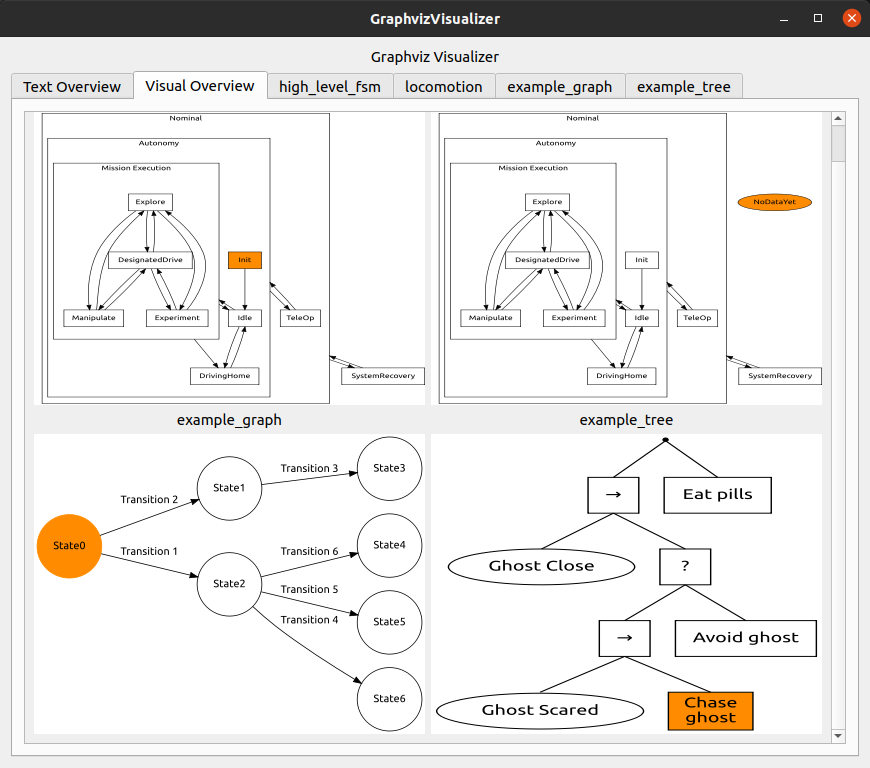

# Graphviz visualizer

A tool to display generic Graphviz graphs in a GUI and dynamically update them based on events.  
Made possible via text generation using Jinja2, the Graphviz Python API pydot, and Qt.  
The repository contains some example graphs but you can exchange them for your own.

Can be used as a ROS 2 package or as a raw Python program.



The tool also provides a way to display the state of a system using colored markers.  
Here it was used to indicate the liveliness of ROS nodes but other use cases are possible.

## How to use with ROS 2

Be aware that you need the `graphviz_visualizer_interfaces` package in the same workspace to generate the required messages.  
You can find it here: <https://github.com/lFatality/graphviz_visualizer_interfaces>  
Just add it to the same workspace.

Building the workspace

```
colcon build
source install/setup.bash
```

Starting the GUI:

```
ros2 launch graphviz_visualizer graphviz_visualizer.launch.py
```

Sending a new state to a graph

```
ros2 topic pub /graph/states graphviz_visualizer_interfaces/msg/GraphInfo "{graph_name: 'high_level_fsm', state_name: 'Explore'}"
```

Note that the state name is not the lable of the name. Instead it is the name of the graphviz node.  
This name you can find in the `.j2` template file.
So to change the state of the example tree you'd call the following:

```
ros2 topic pub /graph/states graphviz_visualizer_interfaces/msg/GraphInfo "{graph_name: 'example_tree', state_name: 'ghost_scared'}"
```

Updating the liveliness of a node

```
ros2 topic pub /nodes_alive std_msgs/msg/UInt8MultiArray "{layout: {}, data: [0,1,2]}"
```

## How to use without ROS 2

Starting the GUI:

```
python3 src/graphviz_visualizer/scripts/graphviz_visualizer_no_ros.py
```

Sending events to the graph is done by querying user input in the terminal.
Of course you could embed the code in your application and send events via code instead of user input.
It's just to give you an idea.

```
Enter graph name:high_level_fsm
Enter state:Explore
```

## Adding your own graphs

* Write a `.dot` file with your Graphviz graph. You can check your current graph using `dot -Tpng graph.dot > graph.png`. Be sure to define all graph nodes first, then add their relationships. Otherwise the node order can be affected by the text generation which can lead to different graph structures depending on the active state.
* In your `.dot` file between the node definitions and the relationships add the Jinja2 template parameter and rename it with a `.j2` ending. This can look like this `{{active_state}} [color="darkorange" style="filled"];`. The Jinja2 parameter is given in the double curly braces, the rest is Graphviz code. Jinja2 will replace the `{{active_state}}` with the variable it is provided for that parameter.
* Add your `.j2` file in the `assets/templates` folder.
* You have to let the visualizer know of your template. For that you have to specify a name, an initial state, and the path to the Jinja2 template file. The name is the headline of the graph in the GUI and how you will refer to it when you want to update its state. The initial state is the state it will have when no state update was received yet. Note that this doesn't have to be one of the defined states but can be anything. The template path points to the Jinja2 template you want to use for this graph. Note that you can reuse the same file as often as you want.
  * If you're using ROS: Open the `config/graphs.yaml` file. There add the necessary values to the `names`, `initial_states`, and `dotfile_template_paths` variables.
  * If you're using Python: Upon creation of the graphviz visualizer a dictionary is provided to it with the graph definitions. You have to add your graph to this dictionary. Find an example in `graphviz_visualizer_no_ros.py`.

## How it works

Graphviz is a graph visualization software that converts text files in which a graph is described into images. Jinja2 is a template text generator. The GUI uses a Jinja2 template file containing the definition of a Graphviz graph but with  a placeholder for the active state. Upon reception of a state update the template file is generated by substituting the placeholder with the active state. Then the Graphviz Python API is used to generate an SVG image file from the generated Graphviz file. The generated image can then be displayed in the GUI. This is done using Qt. Since the GUI does not impose any restrictions on the graphs it can display, it can be used to dynamically visualize any graph that can be created with Graphviz. It has to be considered that rendering many images with a high frequency can become computationally expensive. Because of that the image will only be generated anew if the state actually changed. It could also be thought to cache the images but this wasn't done here. For the use case of displaying FSM states which do not change with a high frequency the approach worked fine. The core application is written without any dependencies on ROS to be reusable in other projects that don't use ROS. To be able to control it using ROS an interface has been written that connects the core application and ROS.  This interface listens on a topic on which the states of the graphs are published. Whenever a new state is published, it will trigger a redraw of the corresponding graph visualization.

## Known issues

* Graphs might be displayed distorted

## Further notes

* Tested with ROS 2 Foxy, PySide2 5.15.1, pydot 1.4.1, Jinja2 2.11.2, Graphviz 2.43.0 (0)
